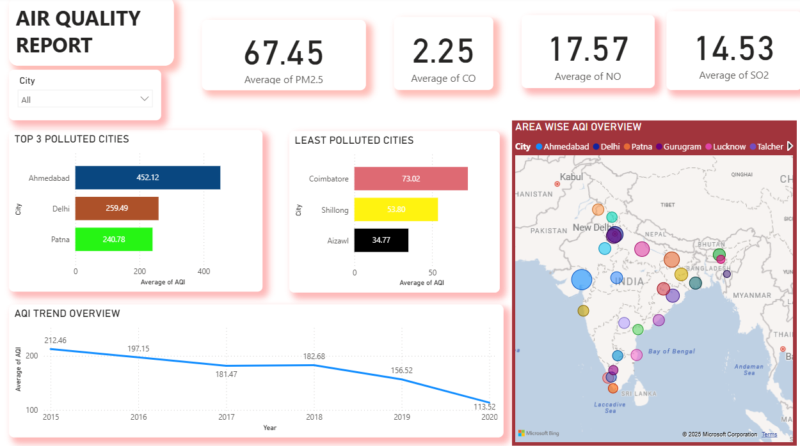

# 🌆 City Pollution Dashboard (Power BI)

## 📘 Overview
The **City Pollution Dashboard** is an interactive data visualization project developed using **Power BI** to analyze air quality and pollution levels across major cities.  
The project focuses on identifying pollution patterns, comparing city-wise air quality indices (AQI), and providing insights into environmental health based on key pollutants.  

This dashboard helps users and policymakers visually explore pollution trends and make data-driven decisions to improve air quality.

---

## 🧠 Objective
- To analyze and visualize **air quality data** from multiple cities.  
- To identify trends, hotspots, and patterns in air pollution.  
- To highlight cities with high AQI levels and determine which pollutants contribute most to poor air quality.  
- To build a professional, interactive dashboard demonstrating data analytics and visualization skills.

---

## 🗂️ Dataset
- **Source:** [Kaggle – Air Quality Data by City](https://www.kaggle.com/)  
- **Format:** CSV  
- **Attributes include:**
  - `City`
  - `Date`
  - `AQI (Air Quality Index)`
  - `PM2.5`, `PM10`
  - `NO2`, `SO2`, `CO`, `O3`
  - `Category` (Good, Moderate, Unhealthy, etc.)

---

## ⚙️ Tools & Technologies
- **Power BI Desktop** – for dashboard creation and interactive visuals  
- **Microsoft Excel** – for initial data cleaning and formatting  
- **Kaggle Dataset** – as data source  

---

## 📊 Key Features & Visuals
- 🌍 **City-wise AQI Overview:** Compare pollution levels across major cities.  
- 📅 **Time-Series Trend Analysis:** Understand how air quality changes over time.  
- 💨 **Pollutant Contribution Chart:** Breakdown of major pollutants (PM2.5, PM10, NO2, etc.) affecting AQI.  
- 🗺️ **Interactive Map Visualization:** Geographical representation of pollution hotspots.  
- 📈 **AQI Category Distribution:** Pie/bar charts representing the frequency of “Good”, “Moderate”, and “Unhealthy” days.  
- 🔍 **Slicers & Filters:** Filter data by date, city, or AQI category for detailed analysis.

---

## 🧩 Dashboard Insights
- Cities with higher industrial and vehicular activity tend to show **consistently high AQI**.  
- Seasonal variation indicates spikes in pollution during winter months.  
- **PM2.5 and NO2** are the most dominant pollutants affecting urban air quality.  
- The dashboard can serve as a foundation for environmental monitoring and policy support.

---

## 🚀 How to Use
1. Clone or download the repository.  
2. Open the `.pbit` file in **Power BI Desktop**.  
3. Load your dataset or connect to the Kaggle CSV file.  
4. Refresh visuals to generate the dashboard.  

---

## 🧰 Skills Demonstrated
- Data cleaning and preprocessing  
- Power BI dashboard design  
- KPI and trend visualization  
- Data storytelling and environmental analytics  

---

## 📸 Dashboard Preview

*(The above image is an actual screenshot from the Power BI dashboard.)*

---

## 📚 Future Improvements
- Integration with **real-time pollution APIs** for live updates.  
- Adding machine learning predictions for AQI forecasting.  
- Creating a **web-embedded Power BI dashboard** for public access.

---

## 👨‍💻 Author
**Sai Kumar Reddy N**  
HKBK College of Engineering  
📧 Email: [saimanikya8152@gmail.com]  
💼 [LinkedIn Profile](https://linkedin.com/in/thesaireddy20)  
💻 [GitHub Profile](https://github.com/thesaireddy20)

---

## 🏷️ Tags
`#PowerBI` `#DataAnalytics` `#Kaggle` `#AirPollution` `#Dashboard` `#DataVisualization` `#SaiKumarReddyN`
